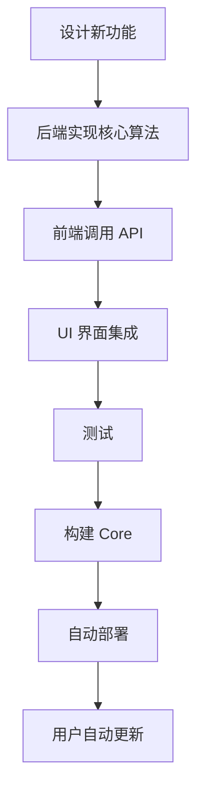

# DesignerCEP 混合架构开发框架指南

## 🎯 框架概述

这是一个**三层混合架构框架**，专为 Adobe CEP 插件设计，实现了：
- **核心算法保护**（服务器端计算）
- **动态更新**（Shell + Core 分离）
- **安全鉴权**（API Key + 详细日志）

---

## 🏗️ 架构层次

```
┌──────────────────────────────────────────────────┐
│  Layer 1: Shell（壳/启动器）                      │
│  职责: 登录、更新、加载 Core                      │
│  更新频率: 极低                                   │
│  位置: 本地安装（PS 扩展目录）                     │
└──────────────────────────────────────────────────┘
                      ↓
┌──────────────────────────────────────────────────┐
│  Layer 2: Core（业务核）                          │
│  职责: UI 界面、简单 JSX 执行                     │
│  更新频率: 高（随时发布新功能）                    │
│  位置: 远程服务器 → 下载到本地缓存                │
└──────────────────────────────────────────────────┘
                      ↓
┌──────────────────────────────────────────────────┐
│  Layer 3: Server（后端服务器）                    │
│  职责: 核心算法、数据处理、鉴权                   │
│  更新频率: 随时                                   │
│  位置: 远程服务器                                 │
└──────────────────────────────────────────────────┘
```

---

## 📝 如何添加新功能

### 示例：添加一个"智能滤镜"功能

#### Step 1: 设计功能流程

```
用户点击按钮 
  → Core 获取图层信息
  → Core 发送到 Server（带 API Key）
  → Server 计算最佳滤镜参数（🔒核心算法）
  → Server 返回参数
  → Core 应用滤镜到图层
```

---

#### Step 2: 后端实现（Server 层）

**文件：** `Server/app/api/v1/jsx_demo.py`

```python
class FilterRequest(BaseModel):
    """滤镜计算请求"""
    layer_id: str
    image_data: str  # Base64 编码的图层预览

class FilterResult(BaseModel):
    """滤镜计算结果"""
    success: bool
    blur_radius: float
    sharpen_amount: float
    saturation: float
    message: str

@router.post("/calculate-filter", response_model=FilterResult)
async def calculate_filter(
    request: FilterRequest,
    x_api_key: Optional[str] = Header(None)
):
    """
    🔒 服务器端智能滤镜计算
    客户端只能拿到参数，看不到算法
    """
    
    # 日志
    logger.info("="*60)
    logger.info("📥 收到滤镜计算请求")
    logger.info(f"   图层ID: {request.layer_id}")
    logger.info(f"   API Key: {x_api_key}")
    logger.info("="*60)
    
    # API Key 验证
    if not validate_api_key(x_api_key):
        logger.warning(f"❌ API Key 验证失败")
        raise HTTPException(status_code=403, detail="无效的 API Key")
    
    logger.info("✅ API Key 验证通过")
    
    try:
        # 🔒 核心算法在这里（客户端看不到）
        # 可以是 AI 模型、图像分析等
        
        # 示例：根据图层 ID 计算参数
        layer_hash = sum(ord(c) for c in request.layer_id)
        
        blur_radius = 2.0 + (layer_hash % 10) / 10
        sharpen_amount = 0.5 + (layer_hash % 5) / 10
        saturation = 1.0 + (layer_hash % 3) / 10
        
        logger.info(f"✅ 计算完成: blur={blur_radius}, sharpen={sharpen_amount}")
        
        return FilterResult(
            success=True,
            blur_radius=blur_radius,
            sharpen_amount=sharpen_amount,
            saturation=saturation,
            message="滤镜参数计算成功"
        )
        
    except Exception as e:
        logger.error(f"❌ 计算失败: {str(e)}")
        return FilterResult(
            success=False,
            blur_radius=0,
            sharpen_amount=0,
            saturation=1.0,
            message=f"计算失败: {str(e)}"
        )
```

---

#### Step 3: 前端实现（Core 层）

**文件：** `Designer/src/api/jsxApi/inline/smart-filter.ts`

```typescript
import { evalInlineJSX, JSXResponse } from './utils';
import { config } from '@/config';

/**
 * 智能滤镜：混合方案
 * 1. 本地获取图层信息
 * 2. 服务器计算最佳参数
 * 3. 本地应用滤镜
 */
export async function applySmartFilter(): Promise<JSXResponse> {
    try {
        // 1. 💻 本地获取图层信息
        const jsx = `
            try {
                if (!$.global.JSXUtils.hasDocument()) {
                    return $.global.JSXUtils.stringify({ error: '没有打开的文档' });
                }
                
                var doc = $.global.JSXUtils.getDocument();
                var layer = doc.activeLayer;
                
                return $.global.JSXUtils.stringify({ 
                    success: true,
                    layerId: layer.id,
                    layerName: layer.name
                });
            } catch (error) {
                return $.global.JSXUtils.stringify({ error: error.toString() });
            }
        `;
        
        const layerResult = await evalInlineJSX(jsx);
        
        if (layerResult.error || !layerResult.success) {
            return layerResult;
        }
        
        // 2. 🌐 发送到服务器计算（核心算法）
        const response = await fetch(`${config.apiBaseUrl}/jsx_demo/calculate-filter`, {
            method: 'POST',
            headers: {
                'Content-Type': 'application/json',
                'X-API-Key': 'demo_key_123'  // 🔐 API Key
            },
            body: JSON.stringify({
                layer_id: layerResult.layerId,
                image_data: ''  // 可选：发送图层预览
            })
        });
        
        if (!response.ok) {
            return { error: '服务器错误' };
        }
        
        const filterResult = await response.json();
        
        if (!filterResult.success) {
            return { error: filterResult.message };
        }
        
        // 3. 💻 本地应用滤镜参数
        const { blur_radius, sharpen_amount, saturation } = filterResult;
        
        const applyJsx = `
            try {
                var doc = $.global.JSXUtils.getDocument();
                var layer = doc.activeLayer;
                
                // 应用服务器计算的滤镜参数
                // 高斯模糊
                layer.applyGaussianBlur(${blur_radius});
                
                // 锐化
                layer.applySharpen();
                
                return $.global.JSXUtils.stringify({ 
                    success: true,
                    message: '智能滤镜应用成功'
                });
            } catch (error) {
                return $.global.JSXUtils.stringify({ error: error.toString() });
            }
        `;
        
        return evalInlineJSX(applyJsx);
        
    } catch (error) {
        return { error: String(error) };
    }
}
```

---

#### Step 4: UI 界面（Core 层）

**文件：** `Designer/src/view/Home.vue`

```vue
<template>
  <a-button @click="handleSmartFilter">智能滤镜</a-button>
</template>

<script setup lang="ts">
import { applySmartFilter } from '@/api/jsxApi/inline/smart-filter';
import { Message } from '@arco-design/web-vue';

const handleSmartFilter = async () => {
  try {
    Message.loading('正在计算最佳滤镜参数...');
    
    const res = await applySmartFilter();
    
    if (res && res.success) {
      Message.success(res.message);
    } else {
      Message.error(res?.error || '执行失败');
    }
  } catch (e: any) {
    Message.error('调用失败: ' + e.message);
  }
};
</script>
```

---

#### Step 5: 部署新功能

```bash
# 1. 构建 Core
cd Designer
npm run build:core

# 2. 发布新版本（使用自动部署脚本）
cd ..
python auto_deploy_core.py

# 3. 用户登录后会自动下载新版本
```

---

## 🔐 API Key 管理

### 添加新的 API Key

**文件：** `Server/app/core/api_keys.py`

```python
VALID_KEYS: Dict[str, dict] = {
    "demo_key_123": {
        "name": "测试密钥",
        "permissions": ["calculate", "filter"],  # 添加权限
        "rate_limit": 100
    },
    "customer_abc_456": {  # 新客户
        "name": "客户 A",
        "permissions": ["calculate"],
        "rate_limit": 200
    }
}
```

### 权限检查

```python
@router.post("/calculate-filter")
async def calculate_filter(request, x_api_key: Optional[str] = Header(None)):
    # 验证 Key
    if not validate_api_key(x_api_key):
        raise HTTPException(403, "无效的 API Key")
    
    # 检查权限
    if not APIKeyManager.check_permission(x_api_key, "filter"):
        raise HTTPException(403, "没有滤镜功能权限")
    
    # 继续处理...
```

---

## 📊 日志监控

所有请求都会自动记录：

```
============================================================
📥 收到滤镜计算请求
   图层ID: Layer_123
   API Key: demo_key_123
============================================================
✅ API Key 验证通过 | 名称: 测试密钥 | 权限: ['calculate', 'filter']
🔒 开始执行核心算法...
✅ 计算完成: blur=2.3, sharpen=0.7
============================================================
```

---

## 🚀 扩展方向

### 1. AI 功能
```python
# Server 端
@router.post("/ai-enhance")
async def ai_enhance(image: str, x_api_key: str):
    # 调用 TensorFlow/PyTorch 模型
    result = ai_model.predict(image)
    return result
```

### 2. 批量处理
```python
@router.post("/batch-process")
async def batch_process(layers: List[str], x_api_key: str):
    results = []
    for layer_id in layers:
        result = process_layer(layer_id)
        results.append(result)
    return results
```

### 3. 数据分析
```python
@router.post("/analyze-design")
async def analyze_design(doc_info: dict, x_api_key: str):
    # 分析设计质量、配色方案等
    analysis = analyze_composition(doc_info)
    return analysis
```

### 4. 实时协作
```python
@router.websocket("/ws/collaborate")
async def collaborate(websocket: WebSocket, x_api_key: str):
    # WebSocket 实时同步
    await websocket.accept()
    # 多用户协作编辑
```

---

## 🛡️ 安全最佳实践

### ✅ 已实现
- API Key 鉴权
- 输入验证
- 详细日志
- 核心算法保护

### ⚠️ 生产环境建议
- 启用 HTTPS
- 添加限流（Rate Limiting）
- IP 白名单
- 定期更换 API Key
- 数据库存储 Key（而非配置文件）

---

## 📚 开发流程总结



---

## 🎯 框架优势

| 特性 | 传统方案 | 本框架 |
|------|---------|--------|
| 核心算法保护 | ❌ 暴露在前端 | ✅ 服务器端执行 |
| 动态更新 | ❌ 需重装插件 | ✅ 自动下载更新 |
| 安全鉴权 | ❌ 无验证 | ✅ API Key + 日志 |
| 可扩展性 | ⚠️ 受限 | ✅ 易于添加功能 |
| 开发效率 | ⚠️ 中等 | ✅ 模板化开发 |

---

## 🎉 总结

这个框架提供了：
1. **完整的三层架构**（Shell → Core → Server）
2. **安全的算法保护**（服务器端计算）
3. **灵活的更新机制**（动态加载 Core）
4. **标准的开发模式**（模板化添加功能）
5. **完善的监控日志**（追踪所有请求）

**适用场景：**
- Adobe CEP 插件开发
- 需要保护核心算法的应用
- 需要频繁更新的软件
- 需要鉴权和监控的服务

---

**现在你可以基于这个框架快速开发新功能了！** 🚀

